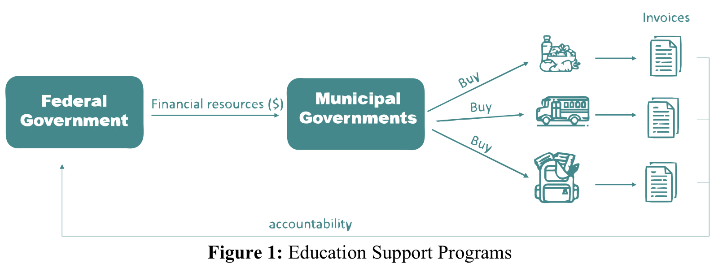
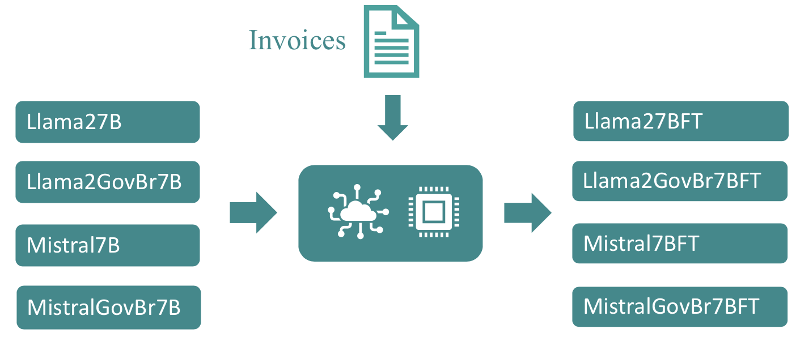

# Continued pre-training of LLMs for Portuguese and Government domain: A proposal for product identification in textual purchase descriptions

This repository contains some code and extra information about the paper "Continued pre-training of LLMs for Portuguese and Government domain: A proposal for product identification in textual purchase descriptions" presented on workshop Publlm at AAAI-24.

## Introduction

The Brazilian government implements a series of programs aimed at promoting the improvement of the quality and access to education. These programs are implemented through the transfer of financial resources to municipalities. There is a program for the purchase of food to be served to students, another for the purchase of educational materials, and another for the purchase of spare parts for vehicles used in school transportation, among other programs whose goal is to support activities related to the education of children.​
Entities that receive these financial transfers must account for the funds received. One of the accountability activities involves submitting invoices that verify the incurred expenses. These invoices contain specifications of the items purchased, as well as the corresponding payment amounts.​





However, the specifications of the acquired products do not follow a single defined standard, so the same product can be specified in different ways, making the analysis and comparison of purchased items challenging.​

Therefore, it is necessary to develop automated techniques that can handle the various ways of specifying a particular product and identify which products these specifications refer to.​

Currently, large language models have proven to be very efficient in performing this type of task. However, most available models have been trained with limited data in the Portuguese language, which reduces their capacity to carry out tasks related to texts written in Portuguese.​

## Problem Statement

However, the specifications of the acquired products do not follow a single defined standard, so the same product can be specified in different ways, making the analysis and comparison of purchased items challenging.​
Therefore, it is necessary to develop automated techniques that can handle the various ways of specifying a particular product and identify which products these specifications refer to.​
Currently, large language models have proven to be very efficient in performing this type of task. However, most available models have been trained with limited data in the Portuguese language, which reduces their capacity to carry out tasks related to texts written in Portuguese.​


If the number of possible products were limited, this problem could be treated as a textual classification issue. However, the quantity of products that can be acquired within the scope of this program is very large, around 250 thousand products, and each day new products may be acquired, consequently expanding the set of possible classes.
Therefore, given the nature of this problem and the impracticality of treating it as a classification problem, this work aims to explore the ability of large language models to generate standardized texts. The goal is to enable the standardization of different product descriptions so that identical products can be uniquely represented even if they have been described in different ways.

Hence, the goal is to perform fine-tuning on LLMs so that they become “experts” in the task of standardizing product descriptions. However, initial tests indicated that the currently available open-source models had difficulties handling texts in the Portuguese language, as well as understanding terms, expressions, and other cultural elements specific to Brazilian society.


In light of the above, the possibility of continuing the pre-training of these models with Portuguese texts and content specific to the Brazilian reality was considered with the aim of equipping them with the ability to interpret and generate new texts that align with the Brazilian cultural context and the writing standards of the Portuguese language.


## Hypothesis

Continuing the pre-training of LLMs with Portuguese texts enhances the model’s ability to identify products in textual purchase descriptions”.


## Research Proposition

The research is divided into 3 steps: first, we continued the pre-training of the Llama2-7B and Mistral-instruct-7B models with data in Portuguese. Then, we performed fine-tuning for the product identification task. Finally, we applied the obtained model to the set of invoices.


## Portuguese Data


BrWaC - Brazilian Portuguese Web as Corpus: a corpus of Brazilian Portuguese text collected from the web; Audit Reports: Reports from the CGU cover inspections conducted in Brazilian states and municipalities, as well as audits carried out in public bodies of the Federal Executive Power of Brazil; Carolina Corpus: a corpus with textual data collected from the web. This corpus includes texts from the judiciary and legislative branches of Brazil, public domain literary works, journalistic texts, social media and wiki texts; PhD PP Thesis FGV: database with academic papers addressing topics related to public policies; Federal Laws: textual set collected from the web with the content of Brazilian laws.

## Continuation of model’s pre-training


Prompt:
```
You are an assistant that organizes items from invoices. For each provided description, organize the data in JSON format, placing the product, brand, quantity, and unit of measurement information separately. If numbers use a comma to separate decimals, use the American notation in the JSON.
 
### Description:
 ACHOCOLATADO INST 400G FABISE
 
### Response:
{
  product: ACHOCOLATADO INSTANTÂNEO,
  brand: FABISE,
  quantity: 400,
  unit_of_measurement: g,
}
 
### End
```




## Evaluation​


## Conclusions

This study not only contributes to solving specific challenges related to product identification in Portuguese texts but also to a broader understanding of the crucial role that continuing the pre-training can play in enhancing the performance of language models in specialized linguistic tasks. These advancements have significant implications not only for the academic community but also for professionals seeking effective solutions in practical and applied contexts.

